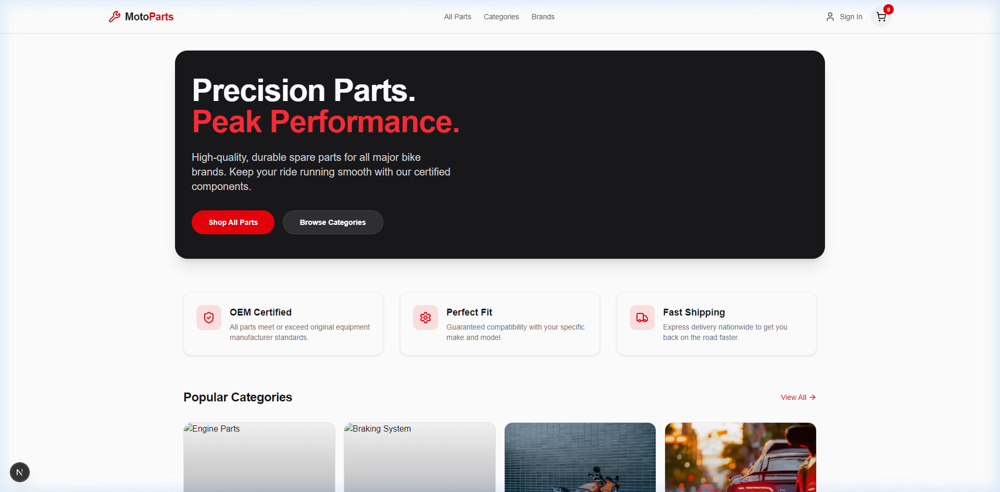
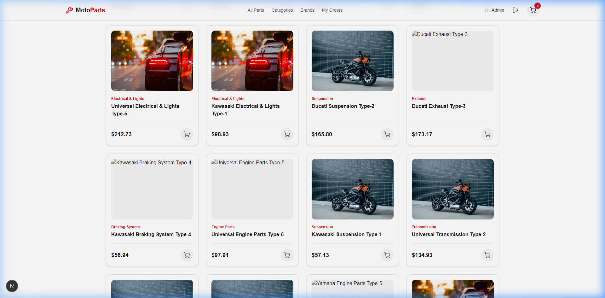
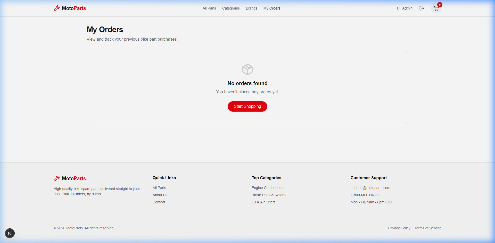

# MotoParts E-Commerce Platform 🏍️

MotoParts is a premium, high-performance full-stack e-commerce solution for bike spare parts. Built with **Next.js 15**, **Node.js/Express**, and **MongoDB**, it features a sleek dark-themed UI, robust authentication, and a seamless shopping experience.

## ✨ Features

- **Modern UI/UX**: Professional dark-mode design using Tailwind CSS and Lucide Icons.
- **Full Catalog**: 60+ bike parts categorized by system (Braking, Engine, Exhaust, etc.).
- **Dynamic Filtering**: Shop by Category or Brand (Yamaha, Honda, Ducati, etc.).
- **User Authentication**: Secure JWT-based Login and Registration.
- **Interactive Cart**: Real-time quantity controls (+/-) and persistent storage.
- **Order History**: Track your past purchases with detailed order summaries.
- **SEO Optimized**: Next.js Server Components for fast loading and search engine visibility.

## 🚀 Screenshots

### Homepage


### Product Catalog


### User Orders


## 🛠️ Tech Stack

- **Frontend**: Next.js 15, React, Tailwind CSS, Lucide Icons, Zustand (State Management).
- **Backend**: Node.js, Express, TypeScript.
- **Database**: MongoDB (Mongoose), Atlas cluster.
- **Payments**: Stripe (Infrastructure ready).

## 📦 Setup & Installation

1. **Clone the repository**:
   ```bash
   git clone https://github.com/AmanJaiSingh/Moto_parts.git
   ```

2. **Backend Setup**:
   - Navigate to `/backend`
   - Install dependencies: `npm install`
   - Setup `.env` with your `MONGO_URI` and `JWT_SECRET`.
   - Seed data: `npx ts-node src/seeder.ts`
   - Start server: `npm run dev`

3. **Frontend Setup**:
   - Navigate to `/frontend`
   - Install dependencies: `npm install`
   - Start development server: `npm run dev`

## 🤝 Contribution
Created as a professional portfolio project for MotoParts.
